# In-browser PDF mark-up (PP-2176)

How editors, reviewers and QA mark up PDF jobs in the creative portal
using Adobe's PDF Embed viewer, and what the platform does with those
marks from the first job to the customer's delivered file.

- **Ticket:** [PP-2176](https://proofed.atlassian.net/browse/PP-2176)
- **Pull request:** [#2517](https://github.com/Proofed/B2BWebserver/pull/2517)
- **Apps touched:** creative portal (viewer, job panel, API routes),
  `packages/shared` (PDF utilities, version rules)

Contents:

1. [Summary](#1-summary)
2. [Business flow](#2-business-flow)
3. [Who sees which name](#3-who-sees-which-name)
4. [Versions stored for a PDF order](#4-versions-stored-for-a-pdf-order)
5. [Architecture](#5-architecture)
6. [Technical flows](#6-technical-flows)
7. [Adobe and AI-service behaviour we design around](#7-adobe-and-ai-service-behaviour-we-design-around)
8. [Configuration](#8-configuration)
9. [Errors and observability](#9-errors-and-observability)
10. [Testing](#10-testing)
11. [Design decisions](#11-design-decisions)
12. [Out of scope and follow-ups](#12-out-of-scope-and-follow-ups)
13. [File map](#13-file-map)

---

## 1. Summary

Before PP-2176, an editor working a PDF job downloaded the file, marked
it up in a desktop tool and uploaded it back. Now a PDF job opens in
Adobe's viewer inside the portal, with Adobe's mark-up tools
(highlight, strike-through, underline, comments, drawing).

What the feature guarantees:

| Guarantee                                     | How                                                                                 |
| --------------------------------------------- | ----------------------------------------------------------------------------------- |
| Marks are never lost while working            | Autosaved as small drafts; saved on collapse, tab hide, tab close and before submit |
| One document per submission                   | The PDF Adobe holds is uploaded once, on Submit                                     |
| Internal staff see who made each mark         | Marks are authored with the user's role: Editor, Reviewer, QA, Admin                |
| The customer never sees an internal name      | Every mark Proofed made says "Proofed" in the customer's file                       |
| The customer's own comments keep their author | Authors named on the order's original file are kept                                 |
| Sideways pages open upright                   | Orientation is detected from the text and corrected when served                     |
| The old way still works                       | Download-and-upload is always one click away                                        |

Mark-up only: Adobe's free viewer cannot edit the text of a PDF, and
the team agreed that is not needed.

---

## 2. Business flow

### 2.1 An order through its jobs

A PDF order passes through a sequence of jobs. Some are people (editor,
reviewer, QA); some are AI jobs that run on their own. Each job starts
from the document the previous job produced.

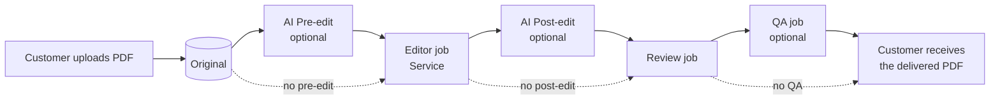

People mark up in the browser; AI jobs write their marks straight into
the PDF through the AI service. Either way, the next job opens a PDF
that already contains every earlier mark.

### 2.2 An editor's journey

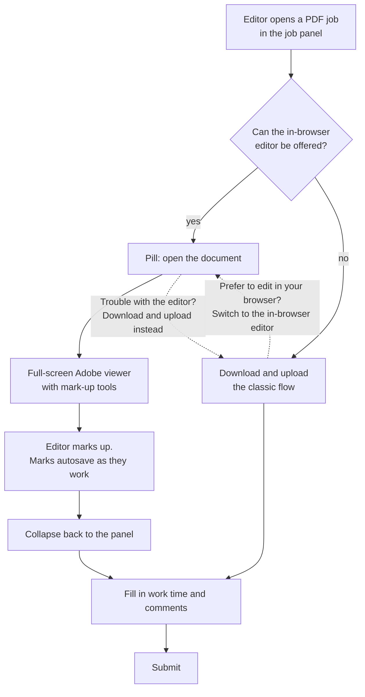

The in-browser editor is offered when **all** of these hold:

| Condition                                               | If not                                                                |
| ------------------------------------------------------- | --------------------------------------------------------------------- |
| The job's format is PDF                                 | Other formats never see the viewer                                    |
| An Adobe client ID is configured for this domain        | Download-and-upload only                                              |
| Adobe's script loaded in this browser                   | Download-and-upload only (blocked by an ad blocker, proxy or network) |
| The job has a document to open                          | Download-and-upload only                                              |
| The document is 50 MB or smaller, and its size is known | Download-and-upload only                                              |

Switching between the two ways never loses marks. Marks made in the
browser are saved as a draft when the viewer collapses, and come back
when the editor returns to it. A file uploaded in download-and-upload
is submitted as uploaded; it does not pick up drafted marks.

### 2.3 What reviewers and QA see

A reviewer opens the editor's document with the editor's marks already
in it, each labelled **Editor** in Adobe's comments pane. The
reviewer's own marks appear as **Reviewer**. QA sees both, and adds
**QA**. The reviewer can edit or delete the editor's marks, as agreed
with the product owner.

If an AI job ran between two people, the next person opens the AI's
output: it is the newest document and holds the AI's marks. In that
case every earlier mark shows as **Proofed** (see
[section 12](#12-out-of-scope-and-follow-ups)).

### 2.4 What the customer receives

The customer's file is the last submitted PDF, in which:

- every mark Proofed made (people and AI) says **Proofed**;
- comments the customer made in their original file keep the
  customer's name;
- pages are the right way up;
- nothing else about the document changes.

The customer can delete or change marks in their own reader.

---

## 3. Who sees which name

The name shown against a mark is the PDF's standard author field
(`/T`). The same mark carries different names in different copies:

| Mark made by                          | In the viewer (internal) | In the internal copy    | In the customer's copy |
| ------------------------------------- | ------------------------ | ----------------------- | ---------------------- |
| Editor, in the browser                | Editor                   | Editor                  | Proofed                |
| Reviewer, in the browser              | Reviewer                 | Reviewer                | Proofed                |
| QA, in the browser                    | QA                       | QA                      | Proofed                |
| Admin, in the browser                 | Admin                    | Admin                   | Proofed                |
| Editor, in desktop Acrobat (uploaded) | The desktop tool's name  | Editor (the job's role) | Proofed                |
| AI Pre-edit / Post-edit               | Proofed                  | Proofed                 | Proofed                |
| The customer, in their original       | The customer's name      | The customer's name     | The customer's name    |

A mark's author is kept only if that exact name appears on the order's
original file. Our role labels are always rewritten for the customer,
even if the original happens to use one.

---

## 4. Versions stored for a PDF order

Every document state is a `WorkItemContentVersion` in OMS. PP-2176
adds two version types; everything else is unchanged.

| `versionType`                  | Written by                | When                         | Contents                                                              | Read by                                          |
| ------------------------------ | ------------------------- | ---------------------------- | --------------------------------------------------------------------- | ------------------------------------------------ |
| `Original`                     | OMS                       | Order created                | The customer's upload                                                 | The first job; the author check (customer names) |
| none (untyped)                 | OMS                       | A job submits                | A copy of that job's submitted file, as the next job's starting point | The next job                                     |
| none (untyped)                 | AI service (user 901)     | An AI job finishes           | The AI's output, marks signed "Proofed"                               | The next job                                     |
| `PdfAnnotations` **(new)**     | Creative portal (browser) | While a job is worked on     | JSON: this job's own marks only                                       | The same job, to restore after a crash           |
| `EditedCopyInternal` **(new)** | Creative portal (server)  | On submit, first             | The submitted PDF with each mark's role                               | The next internal job                            |
| `EditedCopy`                   | Creative portal (server)  | On submit, second            | The submitted PDF as the customer sees it                             | OMS (seeds the next job), the customer           |
| `ReviewJobDelta`               | Creative portal (server)  | On a review submit (PP-2052) | The editor-vs-reviewer delta                                          | Review feedback                                  |

`PdfAnnotations` and `EditedCopyInternal` are **internal only**: they
are excluded from every file list, from job history and from the admin
view (`excludeInternalContentVersions` in
`packages/shared/utils/workItemContentVersionRules.ts`), and the PDF
route refuses to serve a draft.

### 4.1 Versions through an order

An editor, then an AI post-edit, then a reviewer (order 21654 on
devtest had exactly this shape):

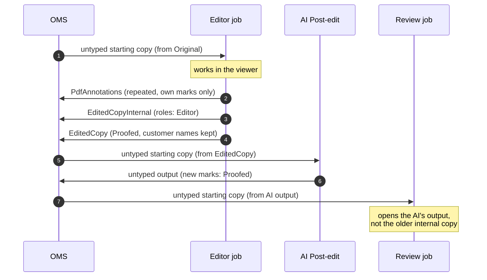

### 4.2 Which document a job opens

`usePdfJobSeedVersion` decides:

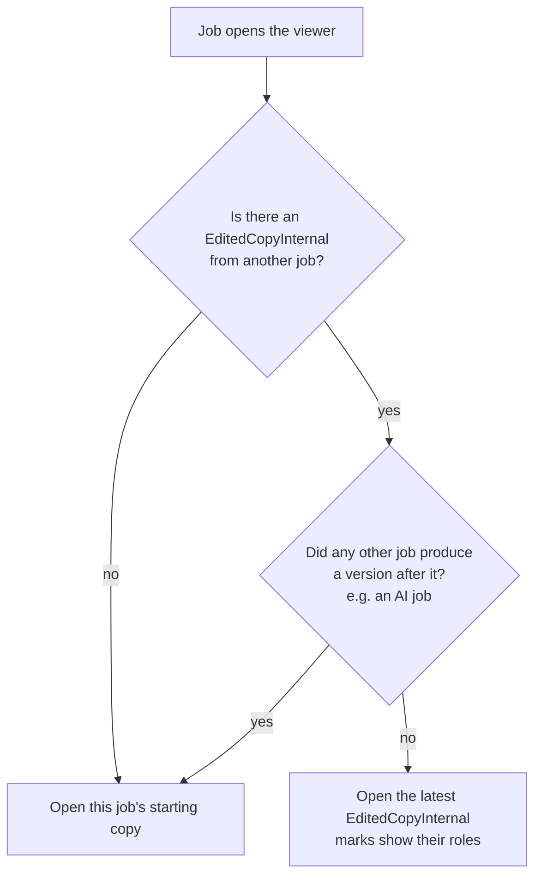

The internal copy's own `EditedCopy`, written a moment later by the
same job, does not count as "after it".

---

## 5. Architecture

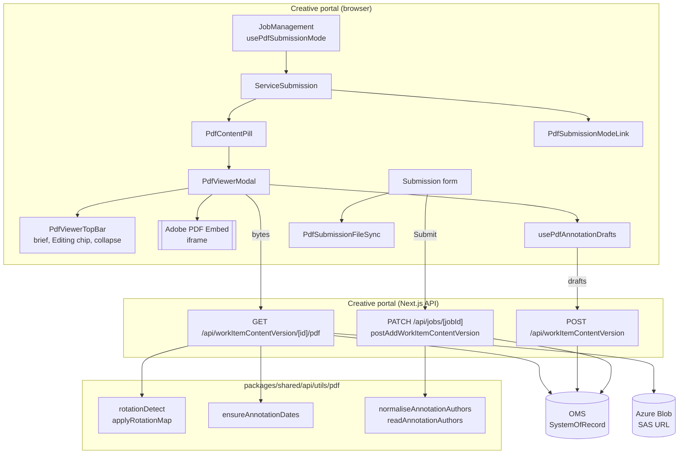

Key points:

- **The signed blob URL never reaches the browser.** The PDF route
  fetches it server-side and streams the bytes behind the session.
- **Mode state lives in `JobManagement`** (`usePdfSubmissionMode`),
  because the job panel is mounted once and shows one job at a time; it
  resets when the job changes.
- **The viewer is hidden, not unmounted, on collapse.** Adobe offers no
  way to ask for a save, so tearing it down would strand any mark made
  since its last save.
- **The admin "submit on behalf" modal** renders the same form but never
  offers the viewer (`DEFAULT_PDF_SUBMISSION_STATE`).

---

## 6. Technical flows

### 6.1 Opening a document

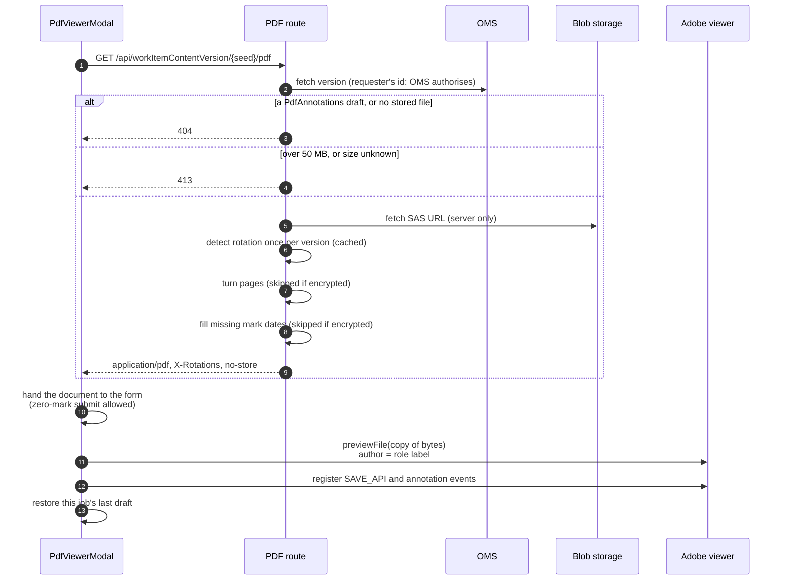

Viewer options (`AUTHORING_PREVIEW_OPTIONS`): mark-up tools and
annotation APIs on, existing marks shown, download and print on,
fit-width.

The viewer passes Adobe a **copy** of the bytes (`buffer.slice(0)`):
Adobe takes ownership of the buffer it is given, so the original is
kept for any later reopen.

### 6.2 Marking up and autosave

Adobe raises an event for every mark added, changed or deleted. The
drafts hook tracks **the ids of this job's own marks** (from those
events, and from the marks it restores) and only ever reads those.

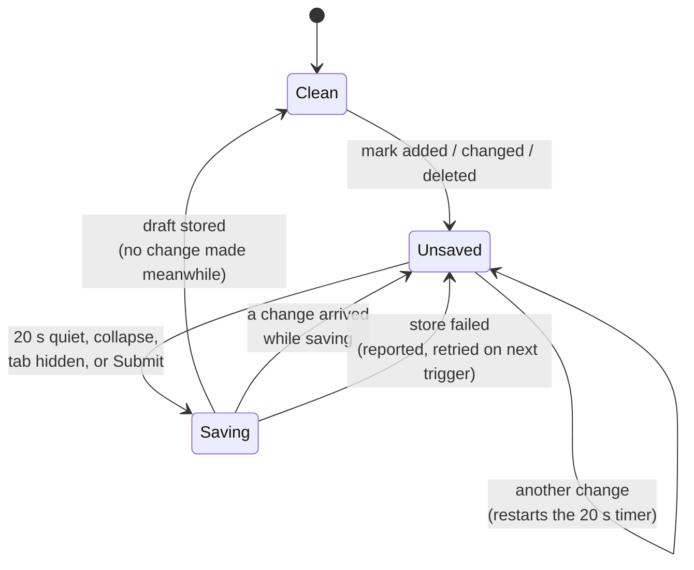

| Trigger                    | What happens                                               |
| -------------------------- | ---------------------------------------------------------- |
| 20 s after the last change | Draft saved                                                |
| Collapse                   | Draft saved straight away, then the panel returns          |
| Tab hidden                 | Marks read fresh and sent by beacon                        |
| Tab closed                 | The last good read is sent by beacon                       |
| Submit                     | Draft saved, then submit waits for Adobe's copy of the PDF |

Rules that keep the record trustworthy:

- **Own marks only.** A draft never contains the AI's or an earlier
  job's marks; those are already inside the PDF.
- **Read by id.** Adobe returns an empty list for a whole document that
  contains the AI's Caret marks, but answers correctly when asked for
  specific ids.
- **One save at a time.** Saves are chained, so an older snapshot can
  never land after a newer one.
- **Never wipe with a guess.** An empty read is only saved when the
  editor was seen deleting marks; otherwise it is treated as a viewer
  that has not settled.
- **Never send the same record twice**, whether by save or by beacon.
- **Stale job.** Once OMS refuses a draft because the job is no longer
  the order's latest, autosave stops.

### 6.3 Restoring after a crash

When the viewer opens, the drafts hook loads the job's newest
`PdfAnnotations` draft and adds its marks back with `addAnnotations`.
Each restored mark is re-addressed to the document being opened (Adobe
silently drops a mark that names a different document) and gets a new
id (Adobe regenerates ids per session). An unreadable draft is skipped;
the document always opens.

### 6.4 Submitting

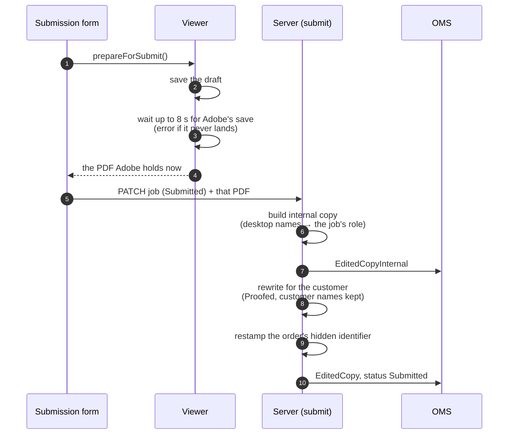

Submit sends the PDF the viewer hands back after the wait, not the copy
the form captured when Submit was clicked. The form's copy can predate
Adobe's last save.

### 6.5 Making the customer's copy safe

`stripPdfInternalAuthors` runs on every PDF submission, from the
browser, from download-and-upload and from the admin modal.

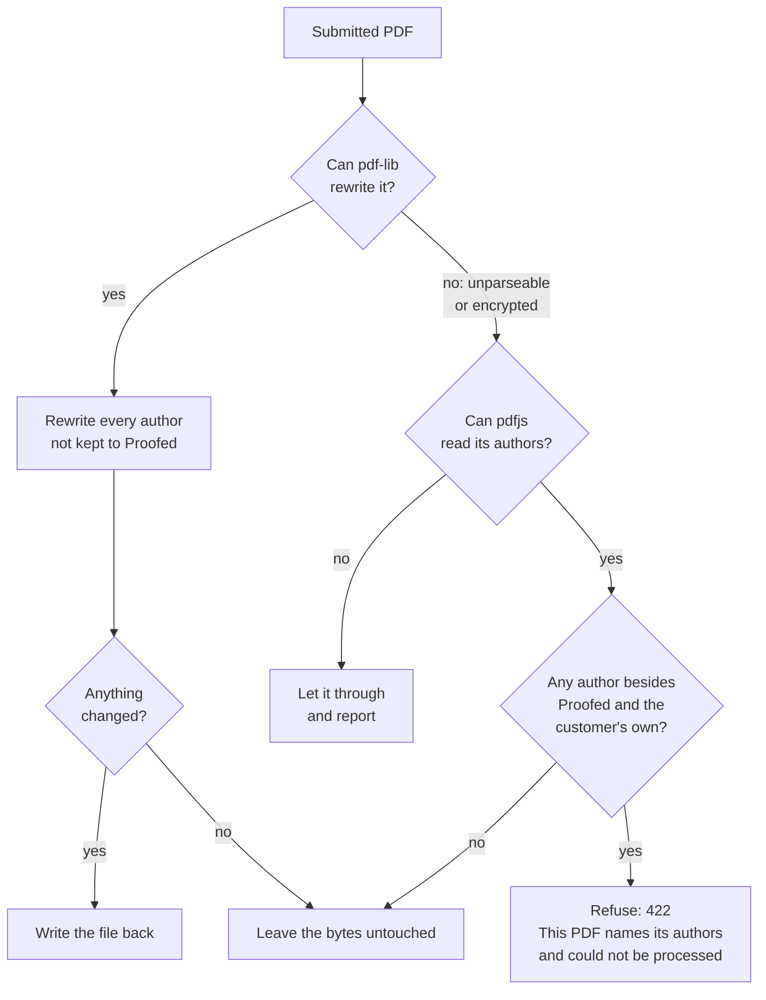

Which authors are kept (`pickKeptPdfAuthors`):

- **Customer's copy:** authors named on the order's `Original`, never
  our role labels.
- **Internal copy:** the same, plus our role labels. Any other name
  (a desktop tool's) becomes the submitting job's role.

The original is read with pdfjs, only when the file names someone other
than "Proofed" or a role. It is cached per order after a successful
read, and skipped above 100 MB. If it can't be read, nothing is kept:
every mark becomes "Proofed", so no internal name can reach the
customer.

Encrypted files are **never re-saved**. pdf-lib keeps the encryption
entry but writes its own objects unencrypted, and the result will not
open. They are checked with pdfjs instead.

### 6.6 Page orientation

Scanned or exported PDFs sometimes store pages sideways. The PDF route
works out each page's reading direction from its text and turns the
page when serving it. The stored file is never changed.

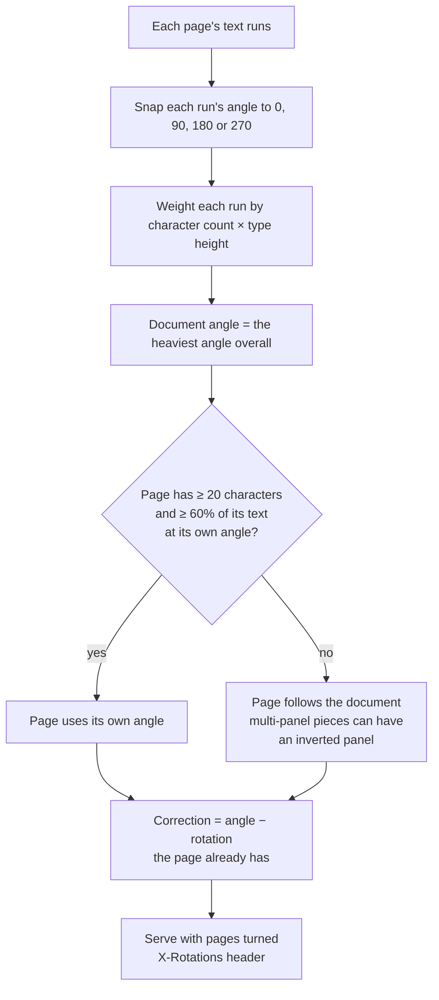

Detection runs once per stored version (cached in memory) and is
idempotent: a file saved after correction reads upright and needs no
further turn. Ported from the beta (`tvm-quickproof`).

### 6.7 Mode switching and fallback

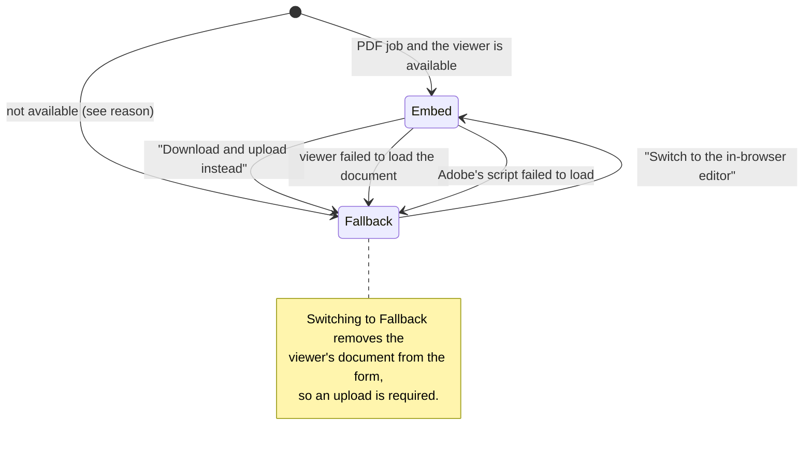

Unavailable reasons (`PdfEmbedUnavailableReason`): `unsupportedFormat`,
`missingClientId`, `sdkLoadFailed`, `noSeedVersion`, `overCeiling`.

---

## 7. Adobe and AI-service behaviour we design around

Measured on real devtest orders; each shaped a rule above.

| Behaviour                                                                                                                               | Consequence in our design                                                               |
| --------------------------------------------------------------------------------------------------------------------------------------- | --------------------------------------------------------------------------------------- |
| The author is set by `GET_USER_PROFILE_API` and written to `/T` on save                                                                 | Marks are authored with the role; the server rewrites it for the customer               |
| `updateAnnotation` ignores a new `creator`                                                                                              | We never relabel marks in the browser                                                   |
| Mark ids are regenerated each session; `created` is re-stamped on save; saved boxes are padded a few points                             | Marks cannot be matched between file and record; the file is the single source of marks |
| A mark addressed to a different document is dropped silently                                                                            | Restored marks are re-addressed to the open document                                    |
| Adobe detaches the buffer passed to `previewFile`                                                                                       | The viewer passes a copy                                                                |
| `getAnnotations()` throws "Invalid time value" on an undated mark                                                                       | The PDF route fills missing `/CreationDate` and `/M`                                    |
| `getAnnotations()` returns an empty list if any Caret mark is present                                                                   | Drafts read this job's marks by id                                                      |
| Annotation tools require full-window mode; the APIs require the tools                                                                   | The viewer is full screen with tools on                                                 |
| No programmatic save; `SAVE_API` fires on focus loss                                                                                    | Collapse hides the viewer; submit waits for the save                                    |
| The AI service writes marks with no dates, signed "Proofed", with Caret marks for replacements and ids that repeat per page (`fitz-A0`) | Covered by the date fill and read-by-id; AI labels are a follow-up                      |

---

## 8. Configuration

| Variable                            | App             | Required | Purpose                                  |
| ----------------------------------- | --------------- | -------- | ---------------------------------------- |
| `NEXT_PUBLIC_ADOBE_EMBED_CLIENT_ID` | creative portal | No       | Adobe PDF Embed client ID for the domain |

- Adobe issues **one client ID per domain**, free. Create one at
  [Adobe's credential page](https://acrobatservices.adobe.com/dc-integration-creation-app-cdn/main.html?api=pdf-embed-api)
  (sign in with a Proofed email via SSO), entering the domain only.
- Domains: `b2btest.proofed.com` (test), `b2bstage.proofed.com`
  (staging), `new.proofed.com` (production), `localhost` (each
  developer).
- It is read at runtime (`next-runtime-env`), so no rebuild is needed.
- **Unset is safe:** the viewer is not offered and editors keep
  download-and-upload. The code can ship before the IDs exist.
- Declared in `apps/creative-portal/env.js` (`.notRequired()`), listed
  in `env.test.ts`, documented empty in `.env.example`.

Limits in code:

| Constant                                | Value        | Where                                      |
| --------------------------------------- | ------------ | ------------------------------------------ |
| `PDF_EMBED_SIZE_CEILING_BYTES`          | 50 MB        | `config/adobeEmbed.ts`                     |
| `PDF_DRAFT_DEBOUNCE_MS`                 | 20 s         | `config/pdfAnnotationDraft.ts`             |
| `PDF_SAVE_WAIT_MS` / `PDF_SAVE_POLL_MS` | 8 s / 250 ms | `config/pdfSubmission.ts`                  |
| `ORIGINAL_AUTHORS_MAX_BYTES`            | 100 MB       | `api/utils/jobs/readOriginalPdfAuthors.ts` |

---

## 9. Errors and observability

Every failure path reports to Sentry with an `operation` tag and never
logs the signed URL or document contents.

| `operation`                                   | Meaning                                       | User impact                              |
| --------------------------------------------- | --------------------------------------------- | ---------------------------------------- |
| `pdf-viewer.sdk-load`                         | Adobe's script failed to load (reported once) | Download-and-upload offered              |
| `pdf-viewer.open`                             | The viewer could not open the document        | Toast; falls back to download-and-upload |
| `pdf-viewer.flush-before-submit`              | Draft could not be saved at submit            | Submit continues with Adobe's PDF        |
| `pdf-viewer.rotation-apply`                   | Pages could not be turned                     | Served as stored                         |
| `pdf-viewer.annotation-dates`                 | Dates could not be filled                     | Served as stored                         |
| `work-item-content.save-pdf-draft`            | A draft could not be stored                   | Retried on the next trigger              |
| `work-item-content.read-pdf-marks`            | Adobe refused to hand the marks back          | Retried on the next change               |
| `work-item-content.restore-pdf-draft`         | A draft could not be restored                 | Document opens without it                |
| `work-item-content.pdf-internal-copy`         | The internal copy could not be stored         | Next job opens the customer copy         |
| `work-item-content.pdf-original-authors`      | The original could not be read                | Every mark becomes "Proofed"             |
| `work-item-content.pdf-strip-authors.rewrite` | pdf-lib could not rewrite the file            | Checked with pdfjs instead               |
| `work-item-content.pdf-strip-authors.read`    | Neither parser could read the file            | Let through                              |
| `work-item-content.pdf-restamp`               | The order identifier could not be restamped   | Submission continues                     |

A PDF that cannot be made safe is refused with **422** and the message
_"This PDF names its authors and could not be processed. Use the
in-browser editor, or remove the author names before uploading."_,
which the job panel shows in its toast.

---

## 10. Testing

Unit tests (Vitest) sit next to each file. The main ones:

| Area                   | Tests                                                                                                                                                |
| ---------------------- | ---------------------------------------------------------------------------------------------------------------------------------------------------- |
| PDF utilities (shared) | `normaliseAnnotationAuthors`, `readAnnotationAuthors`, `ensureAnnotationDates`, `applyRotationMap`, `rotationDetect`, `collectAnnotations`, `utils`  |
| Version rules          | `workItemContentVersionRules` (internal types excluded everywhere)                                                                                   |
| Submit (server)        | `stripPdfInternalAuthors`, `storePdfInternalCopy`, `readOriginalPdfAuthors`, `patchJob` (PDF internal copy before the PP-2052 delta)                 |
| PDF route              | `getWorkItemContentVersionPdf` (404, 413, rotation, dates, SAS never exposed)                                                                        |
| Viewer                 | `PdfViewerModal/hooks`, `PdfViewerTopBar`, `useAdobeEmbedSdk`                                                                                        |
| Drafts                 | `usePdfAnnotationDrafts` (debounce, own marks by id, restore, beacon, serialised saves)                                                              |
| Panel                  | `usePdfSubmissionMode`, `usePdfJobSeedVersion`, `PdfContentPill/hooks`, `ServiceSubmission/hooks`, `Submission/hooks`, `PdfSubmissionFileSync/hooks` |

Manual checks on devtest before release:

1. A customer comment in the original keeps its author; the editor's
   marks say "Proofed".
2. A permission-protected original still opens after submit.
3. A sideways page opens upright, and stays upright after submit and
   reopen.
4. Leaving the viewer while it loads attaches no file and shows no
   error.
5. Blocking `acrobatservices.adobe.com` falls back to
   download-and-upload.
6. A mark made just before closing the tab is restored.
7. A PDF marked in desktop Acrobat and uploaded shows "Editor" to the
   reviewer.
8. Editor → Reviewer: the reviewer sees "Editor" on the editor's marks;
   the customer sees "Proofed".
9. A file over 50 MB offers download-and-upload only.
10. Non-PDF jobs are unchanged.

---

## 11. Design decisions

| Decision                                                            | Why                                                                                                                                |
| ------------------------------------------------------------------- | ---------------------------------------------------------------------------------------------------------------------------------- |
| The PDF file is the single source of marks                          | Marks arrive from three places: the viewer, the AI service and desktop uploads. Only the file holds all three.                     |
| Store the submitted PDF twice (`EditedCopyInternal` + `EditedCopy`) | The next internal job needs roles; the customer must not see them.                                                                 |
| Drafts are crash recovery only                                      | They hold one job's marks and are never used to display or rebuild a document.                                                     |
| No merging of file and record                                       | Tried and removed: Adobe re-stamps dates and pads boxes, so the same mark could not be matched and reviewers saw every mark twice. |
| No rebuilding the PDF from records                                  | AI and upload marks have no record and would be lost.                                                                              |
| Roles labelled server-side                                          | The guarantee holds whatever the browser sends.                                                                                    |
| No IndexedDB                                                        | One store (OMS) for drafts.                                                                                                        |
| Orientation corrected on serve, never stored                        | Serving twice gives the same result instead of turning a page twice.                                                               |
| Show/hide-roles switch                                              | Dropped: internal users always see roles; only the customer sees "Proofed".                                                        |

---

## 12. Out of scope and follow-ups

Agreed with the product owner (PP-2176 comment 76970) to handle in new
tickets:

- **AI mark labels.** AI marks show as "Proofed" to internal users, and
  after an AI post-edit the reviewer also sees the editor's marks as
  "Proofed" (the AI works from the customer copy). Proposed fix, on our
  side: when a PDF opens after an AI job, compare each AI job's output
  with the file it was given (by page and mark id; the AI keeps ids)
  and label new marks with the AI job's name.
- **The viewer in the admin "submit on behalf" modal.** Admins keep the
  upload for now.

Open questions:

- After a crash-restore with no new mark, does Adobe save the restored
  marks so submit can proceed?
- Should the browser's create route accept only `PdfAnnotations`?
- Does the OMS client API refuse internal version types to customers?
  If not, add a guard in the customer portal's by-id handler.
- Full-screen modals lack dialog semantics and focus return (shared
  with the WYSIWYG modal).

Raised with the backend and AI teams (comments 76966–76968):

- OMS stores each job's starting copy as a byte-for-byte duplicate with
  no `versionType`; the AI service's output has no type either.
- The AI service writes undated marks, Caret marks and per-page ids.
- Each environment needs its own Adobe client ID.
- A file over roughly 22 MB can exceed ASP.NET's 30 MB request limit
  once base64-encoded (existing limit, not new).

---

## 13. File map

**Creative portal**

| Path                                                                                 | Role                                                           |
| ------------------------------------------------------------------------------------ | -------------------------------------------------------------- |
| `components/organisms/modals/PdfViewerModal/`                                        | Full-screen viewer; Adobe lifecycle, save wait, unmount guards |
| `components/organisms/modals/PdfViewerModal/partials/PdfViewerTopBar/`               | Title, status, Brief popover, Editing chip, collapse           |
| `components/organisms/sidebars/contents/PdfContentPill/`                             | The pill that opens the viewer; builds the brief               |
| `components/organisms/sidebars/contents/HTMLContentPill/partials/ContentPillButton/` | The pill button shared with WYSIWYG jobs                       |
| `components/molecules/PdfSubmissionModeLink/`                                        | The switch links between the two ways                          |
| `components/molecules/FullscreenModal/`                                              | Shared full-screen shell (taller header variant)               |
| `components/organisms/sidebars/contents/JobManagement/partials/ServiceSubmission/`   | Places the pill or the upload; attribution                     |
| `components/organisms/sidebars/contents/JobManagement/partials/Submission/`          | Submit; waits for the viewer's PDF                             |
| `hooks/usePdfSubmissionMode.ts`                                                      | Availability, mode, the viewer's file                          |
| `hooks/usePdfJobSeedVersion.ts`                                                      | Which document a job opens                                     |
| `hooks/usePdfAnnotationDrafts.ts`                                                    | Autosave, restore, beacons                                     |
| `hooks/useAdobeEmbedSdk.ts`                                                          | Loads Adobe's script; reports failure                          |
| `config/adobeEmbed.ts`                                                               | Adobe types, options, constants                                |
| `config/pdfAnnotationDraft.ts`                                                       | Draft format, role labels                                      |
| `config/pdfSubmission.ts`                                                            | Modes, unavailable reasons, save wait                          |
| `api/workItemContentVersion/[id]/pdf/`                                               | Serves PDF bytes: size, rotation, dates                        |
| `api/utils/jobs/postAddWorkItemContentVersion.ts`                                    | Submit: internal copy, strip, restamp                          |
| `api/utils/jobs/storePdfInternalCopy.ts`                                             | Stores `EditedCopyInternal`                                    |
| `api/utils/jobs/stripPdfInternalAuthors.ts`                                          | Makes the customer's copy safe                                 |
| `api/utils/jobs/readOriginalPdfAuthors.ts`                                           | Customer names from the original; which authors to keep        |
| `api/utils/jobs/restampPdfIdentifier.ts`                                             | Restores the order's hidden identifier                         |

**Shared (`packages/shared`)**

| Path                                                                                  | Role                                                |
| ------------------------------------------------------------------------------------- | --------------------------------------------------- |
| `api/utils/pdf/normaliseAnnotationAuthors.ts`                                         | Rewrites authors (pdf-lib); refuses encrypted files |
| `api/utils/pdf/readAnnotationAuthors.ts`                                              | Reads authors (pdfjs)                               |
| `api/utils/pdf/ensureAnnotationDates.ts`                                              | Fills missing mark dates                            |
| `api/utils/pdf/rotationDetect.ts`, `applyRotationMap.ts`                              | Page orientation                                    |
| `api/utils/pdf/collectAnnotations.ts`, `forEachPdfjsPage.ts`, `utils.ts`, `consts.ts` | Shared PDF helpers                                  |
| `api/workItemContentVersion/enums.ts`                                                 | `PdfAnnotations`, `EditedCopyInternal`              |
| `utils/workItemContentVersionRules.ts`                                                | Keeps internal versions out of every list           |
| `components/atoms/Buttons/RawButton/`                                                 | `isUnderlined` option for the switch links          |
